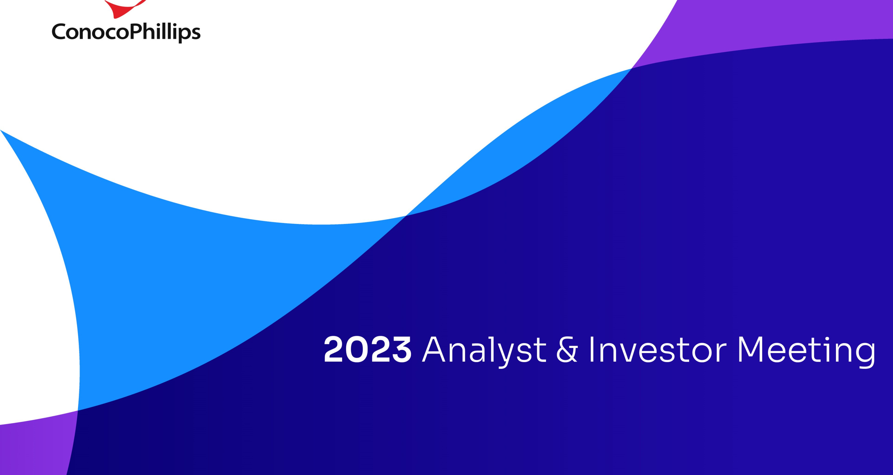
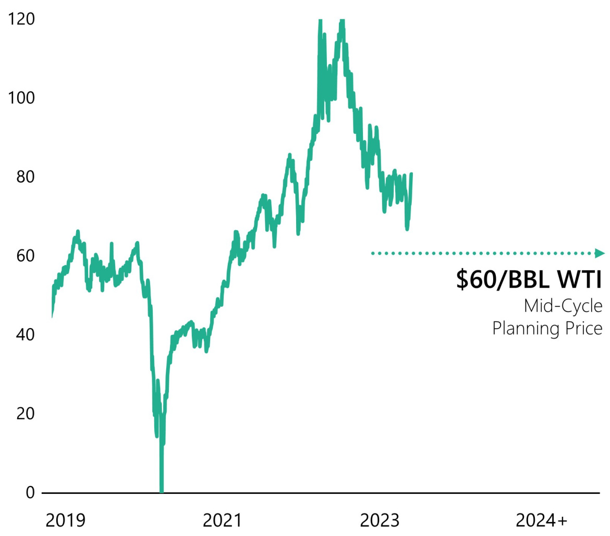
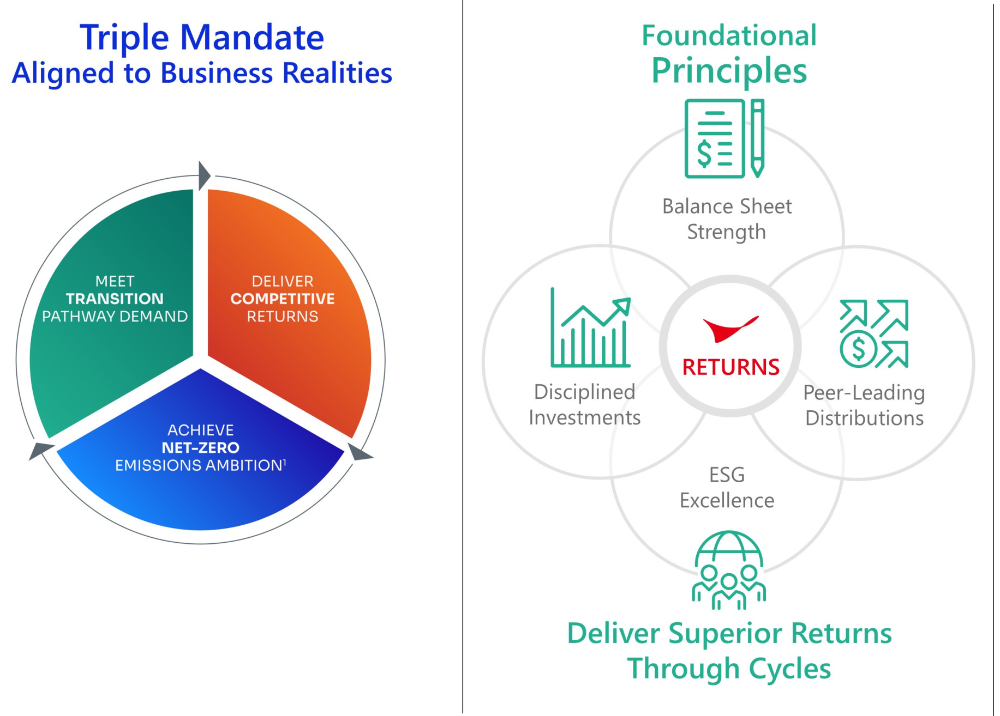

  

# Today's Agenda  

Opening   
Strategy and Portfolio   
Alaska and International   
LNG and Commercial   
Lower 48   
Financial Plan   
Closing  

10-Minute Break Q&A Session  

Ryan Lance Chairman and CEO   
Dominic Macklon  EVP Strategy, Sustainability and Technology   
Andy O'Brien SVP Global Operations   
Bill BullockEVP and CFO   
Nick Olds EVP, Lower 48   
Bill Bullock EVP and CFO   
Ryan Lance Chairman and CEO  

# Cautionary Statement  

hipreseiatraerttatiodistiial an oil price of \$60/BL West Texas Intermediate in 2022 dollars, escalating at $2.25\%$ annualy; $2.25\%$   
. a gas price of $\$3.75$ /MBTUHenry Hub in 22dolas,escalaingat $2.25\%$ annualyia an internationalgaspriceof MMBTUTileransferFaity&JapanoreaMarerin222dllars ecalatingat $2.25\%$ annuallyh cost and capital escalation in line ith price escalation; planing caseat \$60/BLWTIlassumes capital de-esclationfrom levls observed in 2z;   
· all productioncmound aualgrowthrtes(CAGRarecalulatdforthe0yearperid 202303; inclusion of carbon tax in the cash flow forecasts for assets where a tax is currently assessed.If no carbon tax exists for the asset, it is not included in the cash flow forecasts; CostfSldsladininearbntaxwhrecarbpolixistsandaproxycarnpricfrasets witht existingcarbpoliileasereertothost fupldeniionintheedifradionalfmatinncarbnosts aree in the Cost of Supply calculation.  

result thisntatntinfado stants detheralurtardlostaentsrelattfureentsaandantipatd reutfatiistratgindthtsferat peratingltsrahicsthat pintfredanstt ad-ing stantsrsad prasshsantat"stmatgico,ined,aantntiaedictehdiw xpect,titoreastgoagidaneuoofoargandotilarsasdidentffadlig staentwethaneof theserdntanthathsntsarent wading beledefthfndataalin thaareeneddfntatndreliliffwxerastinthadinedui Fatsthalatuauafhadeandinddeihehteahagiad pricediffentalteanfetinlanlinghangeulifmgnlitafitnfiteanandtltittythreatsnfldifrastrtu fromapublichealthcrisisorfrm theimpositionorlitingof crudeoilproductionqutasortherationsthatmightemposedbyOECandotheproducingcoutriesand theresulting cmany orthird-partyactionsinreponsetosuchchangesinsuficiet liquidityor ther fatorshastheliserthaoudmact urabitytrprchaehaeandelareandadividendssuchthatwsedosharreurchas prgramnd reduenrttalinatdividendpaymentsinthfuurewhthevaria fixed;changesinxetedlevlsfoilandgasreeverprdtiontentiafailurerdelainachieingexptedreerprdutonvesfrmxistingandfutureilandgasdevelpmentsinldingdtperatinghazardslingrsrnccss exloratratitiuxpedcsticeafanurereialdifltiruinaininingdyinanfalegislatandregaryiniaddresiglbalimacangrtenrentnelihah criseinldingpandeic shas-andidisandanacts rrelatdmanyrgvement plractionsinvestent inandevelmet fcingraltatiegyorceptetafalrerdelaydeliveince futurelw-carbnstrategyincldingoinabitytevelptchlgiedsrutionsorinterrutiosating thetranportatiofooilandgasprodutioninteatonamntacnionsandexchangratftuatonschangeininteational tra relationsirgvmentalolieidldinthisionfpriccarthisionftraderestritinrtrfsnanmteriasrpdtssuchasalinumandsteeusedintoperaonfoubsiesiluinganysantioisedasresulfany ongingiiafiinldintfieenRsiaandrnlittlletyetldingaitlletayesfgnfVeularoaltyleanyandfuredsiior aquistonfaalltibiy thatrgatyralsfranyaedranfuedsiquisiednasisatalthat suhrvalarqurdificatonttmsf thranationi biesfioquisidedathiffiin aticipatittntiaitfrlctnxisingfuurerentarlatntiliabitulingfrndigegatnlingigaratdditlyrtltractnthnchRrtt ofcometitinandcnslidatioin thoilandgaindustrylimitd acesstcapitarinrancrinifiantlyighecostf capitarinurancerelatedtoilqgidityrncertaintyinthedmesticorinterationalfinancialarketsorinvestorentment; generaldmetic ad inteatonal micand polical cndiosdeelntninareult f angoingmiltacfict icling thcnflitteenssaandrainechangesinfisalregrtaxenrnmentalandthelwsapliabletbinand disuptlfretrreteelnrisrrteattlgtrdidhtnlatf oubuissgenrallasetfothfingwithtriandExchangmissolsgallyquirniixpressilaayligattatanyfardingstaentwthasulfnftonen otherwiseWeassumendutytudate thesstatments asf anyfuturedateand eitherfuturedistribtionof thismaterialortheontinued avalabiltyof thismaterial inarchivefomonouwesite hould beeeed toconstitute anupdatorre-affmationof thee figuresas of anyfuture date. Anyfutureudateof the fgures il e povide onlytrough a publicdiscosure indicatigtht fat.  

Use of Non-GAP Financial InformationThispresentation includes non-GAPfinancial measures, whichhelpfailitatecomparisonof companyoperating performance across periods and with peer companies Any historical non-GAPmeasuresinduded herein willbe acompaniedbyareconciliationtotheearestcorespondingGPmeasurebothatheendof thispreentationandonurwesiteatwwwconocophilisomnongaapForforwardloingon-Peasuresweareunabletoprovieareconilitonto thmost comparableGAAPfinancialmeasurebeause theifrmationneeded toreconilethesemeasureisdependent onfuture eentmanyof whichare outsidemanageent's conrolasdescribed aboveAditionall estimating suchGPmeasureand providinga meaningful reconcilationconsistent withouraccounting policiesfor future periods is extremely difficult and requires alevel of precision that is unavailable for these future periods and cannot be accomplished without unreasonable effort. Forward looking non-GAAP measures are estimated consistent with the relevant definitions and assumptions.  

Cationartvethiiladcathflinihttdienedpalandsireedriurersteintsrenta weareprhiitd frmusin inflings with theSEunder theEC's guidelins. USinvestors areurgedtconsidelely theiland gasdislosures inouForm1 andothereortsand flins with theEC.Copies areavailale from th SEC and fro the ConocoPhiis website.  

  

# ConocoPhillips Remains the Must-Own E&P Company  

The Macro Oil Price (\$/BBL WTI)  

# What You'll Hear Today  

  

We are committed to   
delivering superior returns   
on and of capital   
through the cycles  

We have a deep, durable and diverse portfolio  

We are progressing our 2050 Net-Zer0 ambition and accelerating our 2030 GHG emissions intensity reduction target  

# We Are Committed to Our Returns-Focused Value Proposition  

  
1Scope 1 and 2 emissions on a gross operated and net equity basis. Cash from operations (CFO) is a non-GAAP measure defined in the Appendix.  

# Clear and Consistent Priorities  

1 Sustain production and pay dividend  

2 Annual dividend growth  

3 'A'-rated balance sheet  

$>30\%$ of CFO shareholder payout  

5 Disciplined investment to enhance returns  

# We Are Continuously Improving  

<html><body><table><tr><td></td><td>2016 $43/BBL WTI</td><td>2019 $57/BBLWTI</td><td>2022 $94/BBL WTI</td><td colspan="2">Foundational Principles</td></tr><tr><td>Return on Capital Employed</td><td>-4%</td><td>10%</td><td>27%</td><td rowspan="3">Peer-Leading Distributions and Returns</td></tr><tr><td>Return of Capital1</td><td>$1.11/share</td><td>$4.45/share</td><td>$11.73/share</td></tr><tr><td>Net Debt</td><td>$24B</td><td>$7B</td><td>$7B</td></tr><tr><td>Cash From Operations Free Cash Flow</td><td>$5B|$OB</td><td>$12B|$5B</td><td>$29B丨$18B</td><td rowspan="3">Disciplined Investments</td></tr><tr><td>Resource <$40/BBL WTI</td><td>~10 BBOE</td><td>~15 BBOE</td><td>~20 BBOE</td></tr><tr><td>Production</td><td>1.6 MMBOED</td><td>1.3 MMBOED</td><td>1.7 MMBOED</td></tr><tr><td>Emissions Intensity2 (kg CO2e/BOE)</td><td>~39</td><td>~36</td><td>~22</td><td>ESG Excellence</td></tr></table></body></html>

1Defined in the Appendix and presented on a per-share basisusing aerage outstandingdiluted shares. Gross operated GHG emissons Scope and 2), 2 isa preliminary estimate. Cash from operations (CFO), free cash flow (FCF), net debt and return on capital employed (ROCE) are non-GAAP measures. Definitions and reconciliations are included in the Appendix.  