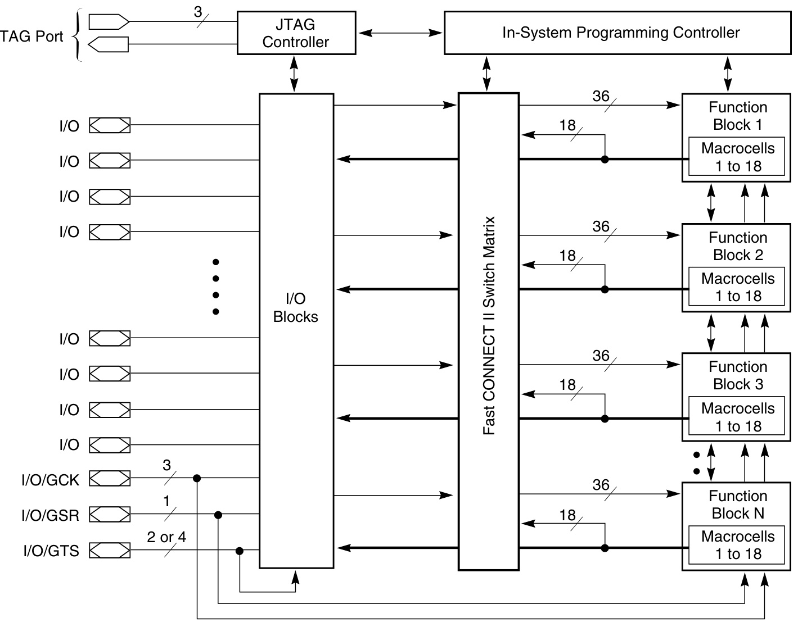
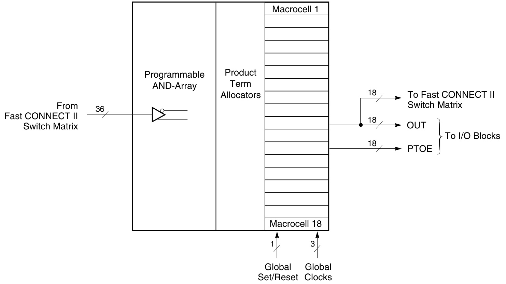

# XILINX  

DS063 (v6.0) May 17, 2013  

# Features  

High-performance 5 ns pin-to-pin logic delays on all pins fCNT to 125 MHz  

Large density range 36 to 288 macrocells with 800 to 6,400 usable gates  

5V in-system programmable Endurance of 10,000 program/erase cycles Program/erase over full commercial voltage and temperature range  

Enhanced pin-locking architecture  

Flexible 36V18 Function Block  

90 product terms drive any or all of 18 macrocells   
within Function Block   
Global and product term clocks, output enables,   
set and reset signals   
Extensive IEEE Std 1149.1 boundary-scan (JTAG)   
support   
Programmable power reduction mode in each   
macrocell   
Slew rate control on individual outputs   
User programmable ground pin capability   
Extended pattern security features for design   
protection   
High-drive 24 mA outputs   
3.3V or 5V I/O capability  

# XC9500 In-System Programmable CPLD Family  

# Product Specification  

Advanced CMOS 5V FastFLASH™ technology Supports parallel programming of multiple XC9500 devices  

# Family Overview  

The XC9500 CPLD family provides advanced in-system programming and test capabilities for high performance, general purpose logic integration. All devices are in-system programmable for a minimum of 10,000 program/erase cycles. Extensive IEEE 1149.1 (JTAG) boundary-scan support is also included on all family members.  

As shown in Table 1, logic density of the XC9500 devices ranges from 800 to over 6,400 usable gates with 36 to 288 registers, respectively. Multiple package options and associated I/O capacity are shown in Table 2. The XC9500 family is fully pin-compatible allowing easy design migration across multiple density options in a given package footprint.  

The XC9500 architectural features address the requirements of in-system programmability. Enhanced pin-locking capability avoids costly board rework. An expanded JTAG instruction set allows version control of programming patterns and in-system debugging. In-system programming throughout the full device operating range and a minimum of 10,000 program/erase cycles provide worry-free reconfigurations and system field upgrades.  

Advanced system features include output slew rate control and user-programmable ground pins to help reduce system noise. I/Os may be configured for 3.3V or 5V operation. All outputs provide $24\mathsf{m A}$ drive.  

Table  1:  XC9500 Device Family   

<html><body><table><tr><td></td><td>XC9536</td><td>XC9572</td><td>XC95108</td><td>XC95144</td><td>XC95216</td><td>XC95288</td></tr><tr><td>Macrocells</td><td>36</td><td>72</td><td>108</td><td>144</td><td>216</td><td>288</td></tr><tr><td>Usable Gates</td><td>800</td><td>1,600</td><td>2,400</td><td>3,200</td><td>4,800</td><td>6,400</td></tr><tr><td>Registers</td><td>36</td><td>72</td><td>108</td><td>144</td><td>216</td><td>288</td></tr><tr><td>TpD (ns)</td><td>5</td><td>7.5</td><td>7.5</td><td>7.5</td><td>10</td><td>15</td></tr><tr><td>Tsu (ns)</td><td>3.5</td><td>4.5</td><td>4.5</td><td>4.5</td><td>6.0</td><td>8.0</td></tr><tr><td>Tco (ns)</td><td>4.0</td><td>4.5</td><td>4.5</td><td>4.5</td><td>6.0</td><td>8.0</td></tr><tr><td>(L)(ZHW) INO,</td><td>100</td><td>125</td><td>125</td><td>125</td><td>111.1</td><td>92.2</td></tr><tr><td>fSYSTEM (MHz)(2)</td><td>100</td><td>83.3</td><td>83.3</td><td>83.3</td><td>66.7</td><td>56.6</td></tr></table></body></html>

1. fCNT $=$ Operating frequency for 16-bit counters. 2. fSYSTEM $=$ Internal operating frequency for general purpose system designs spanning multiple FBs.  

# – PRODUCT OBSOLETE / UNDER OBSOLESCENCE –  

Table  2:  Available Packages and Device I/O Pins (not including dedicated JTAG pins)   

<html><body><table><tr><td></td><td>XC9536</td><td>XC9572</td><td>XC95108</td><td>XC95144</td><td>XC95216</td><td>XC95288</td></tr><tr><td>44-PinVQFP</td><td>34</td><td></td><td></td><td></td><td></td><td></td></tr><tr><td>44-Pin PLCC</td><td></td><td>34</td><td></td><td></td><td></td><td></td></tr><tr><td>48-Pin CSP</td><td>34</td><td></td><td></td><td></td><td></td><td></td></tr><tr><td>84-Pin PLCC</td><td></td><td>69</td><td>69</td><td></td><td></td><td></td></tr><tr><td>100-Pin TQFP</td><td></td><td>72</td><td>81</td><td>81</td><td></td><td></td></tr><tr><td>100-PinPQFP</td><td></td><td>72</td><td>81</td><td>81</td><td></td><td></td></tr><tr><td>160-PinPQFP</td><td></td><td></td><td>108</td><td>133</td><td>133</td><td></td></tr><tr><td>208-PinHQFP</td><td></td><td></td><td></td><td></td><td>166</td><td>168</td></tr><tr><td>352-PinBGA</td><td></td><td></td><td></td><td></td><td>166(2)</td><td>192</td></tr></table></body></html>

1. Most packages available in Pb-Free option. See individual data sheets for more details. 2. 352-pin BGA package is being discontinued for the XC95216. See XCN07010 for details.  

# Architecture Description  

Each XC9500 device is a subsystem consisting of multiple Function Blocks (FBs) and I/O Blocks (IOBs) fully interconnected by the Fast CONNECT™ switch matrix. The IOB provides buffering for device inputs and outputs. Each FB provides programmable logic capability with 36 inputs and  

18 outputs. The Fast CONNECT switch matrix connects all FB outputs and input signals to the FB inputs. For each FB, 12 to 18 outputs (depending on package pin-count) and associated output enable signals drive directly to the IOBs. See Figure 1.  

  
Figure 1:  XC9500 Architecture   
Note: Function block outputs (indicated by the bold lines) drive the I/O blocks directly.  

# Function Block  

Each Function Block, as shown in Figure 2, is comprised of 18 independent macrocells, each capable of implementing a combinatorial or registered function. The FB also receives global clock, output enable, and set/reset signals. The FB generates 18 outputs that drive the Fast CONNECT switch matrix. These 18 outputs and their corresponding output enable signals also drive the IOB.  

Logic within the FB is implemented using a sum-of-products representation. Thirty-six inputs provide 72 true and complement signals into the programmable AND-array to form  

90 product terms. Any number of these product terms, up to the 90 available, can be allocated to each macrocell by the product term allocator.  

Each FB (except for the XC9536) supports local feedback paths that allow any number of FB outputs to drive into its own programmable AND-array without going outside the FB. These paths are used for creating very fast counters and state machines where all state registers are within the same FB.  

  
Figure 2:  XC9500 Function Block  

DS063_02_110501  