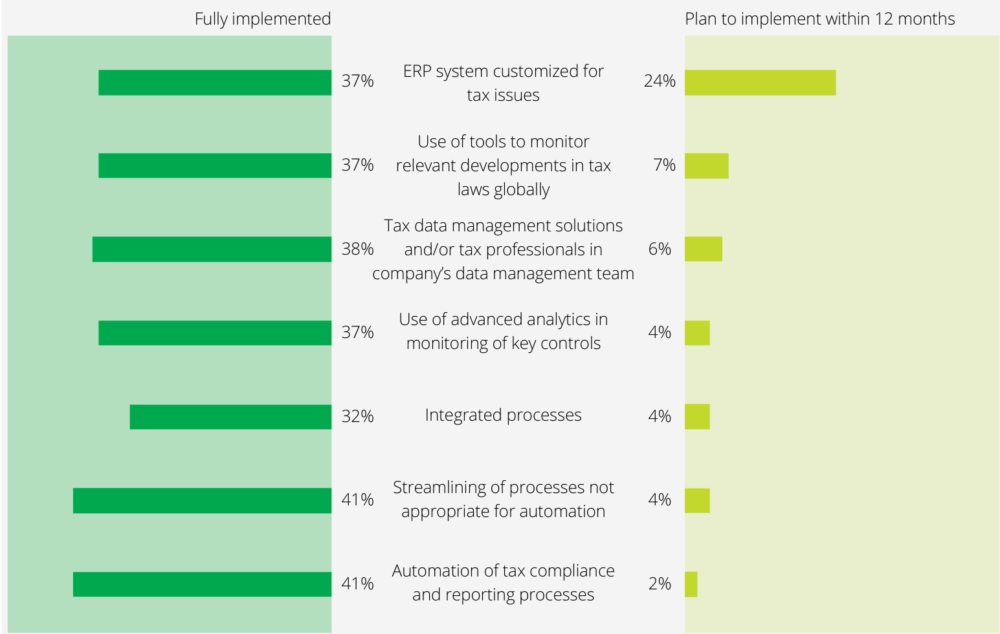
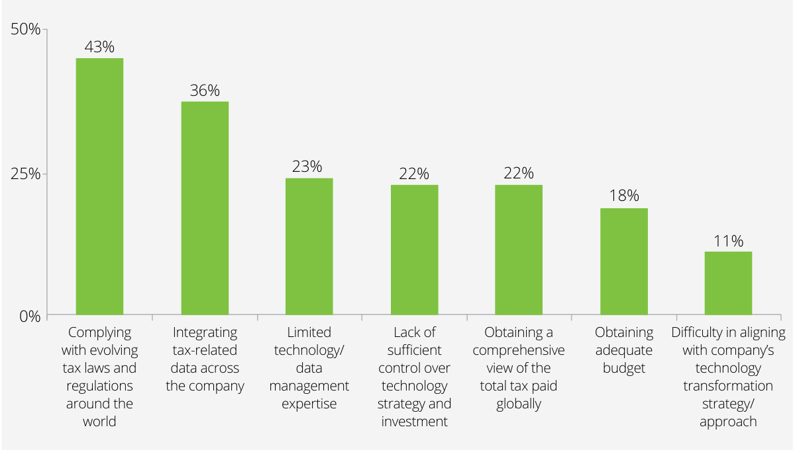
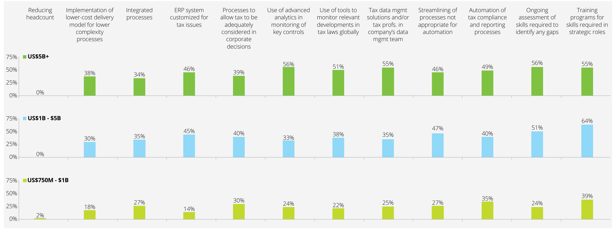
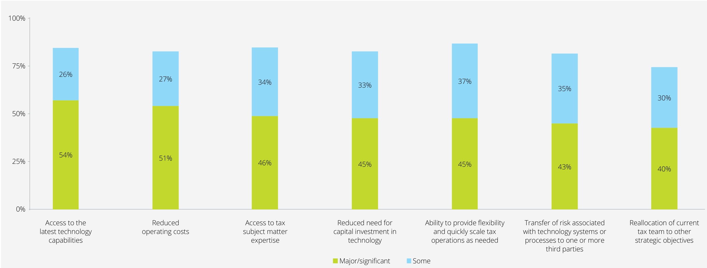
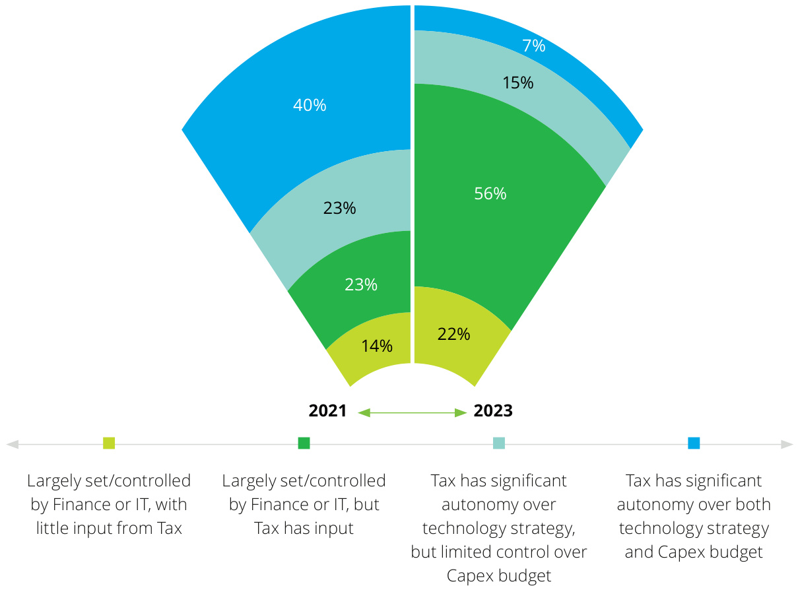
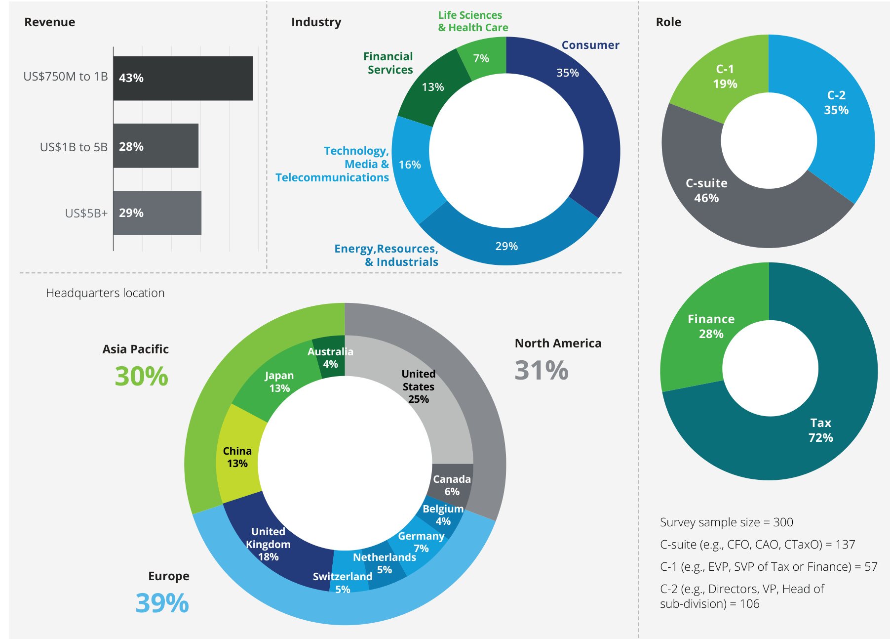

  

Tax in a data-driven world More regulations, more data, more technology  

  

Data and new regulations drive tax transformation  

#  

Immediate access to reliable, accurate, and fit-for-purpose tax data is essential to be able to meet complex tax obligations, real-time reporting requirements, and increasing expectations of tax transparency. Recent developments such as the OECD’s Pillar Two rules, requiring large multinational enterprises to pay a minimum “global tax,” the introduction of CESOP (Central Electronic System of Payment information) and ViDA rules (VAT in a Digital Age) in the EU, e-reporting, and e-invoicing are all examples of initiatives which are increasing the compliance requirements for companies and having a significant impact on tax strategies and operations. Advances in the way technology is used to identify, transform, and manage tax-related data should be an essential component of a business’s response.  

Pillar Two is at the forefront of our mind. We are still quantifying any additional liability and establishing any impact on our Effective Tax Rate. Naturally, there is a huge compliance and systems requirement to accommodate Pillar Two.  

Gemma Beck Head of Tax, Haleon Plc  

Challenges such as version control, manual data collection, or getting the right format and level of data can delay accurate reporting and insights—insights from data being something the respondents to Deloitte’s Tax Transformation Trends 2023 research highlighted as of high importance. The impact of these regulatory and digitalization changes can vary across companies based on their size, region, or industry. Yet, the overall trend has been toward growing workloads and increased complexity.  

In addition, many tax authorities are collecting and sharing more detailed data about taxes and are requesting direct access to large companies’ tax-related data. The digitalization of tax authorities elevates the need for reliable and automated tax models, and generating the right data, in the right format, at the right time. Automating data input, validation, and cleansing can save time and reduce risk, but is also key to enabling the access tax administrations increasingly require.  

All this at a time when businesses are starting to explore the role and benefits of Generative AI, and having to evaluate how trustworthy this technology is, the risks associated with data privacy, as well as the consequences for their employees.  

Technology can also facilitate greater visibility into tax data across the enterprise, which can provide insights that can generate value for the business when making strategic decisions. In short, tax departments increasingly need technology to help them pivot from task completion and cost control toward being able to extract outcome-oriented business insights from compliance activities through analytics.  

Yet, when Deloitte asked 300 tax and finance professionals what progress they had made in implementing tax transformation strategies, $24\%$ stated they intended to implement an ERP system customized for tax issues in the next 12 months (Figure 1). Only $37\%$ of respondents said their tax department had fully implemented the use of tools to monitor relevant developments in tax laws around the world. Similarly, many respondents reported that their tax department had not yet fully implemented the data management and technology applications required by these changes— introduction of tax data management solutions and/or having tax professionals in the company’s data management team $(38\%)$ , and integrated processes $(32\%)$ .  

  
Figure 1. Progress made in implementing tax transformation strategies  

Implementing tax technology, or customizing existing ERP systems, requires identifying the appropriate issues to customize the system for, involving the right stakeholders internally, obtaining budget when there are competing demands, and devising a robust schedule of maintenance.  

1. Customizing technology for global compliance  

Compliance is a top priority for the $\tan\alpha$ department (Figure 2) but to achieve it, comply with Pillar Two, or calculate their global tax liability, tax departments need accurate, timely, tax-related data integrated across their organization. However, achieving visibility into enterprise-wide tax data has proven difficult for many companies, with respondents to Deloitte’s Tax Transformation Trends 2023 survey citing integrating tax-related data across the company $(36\%)$ as their second-most important challenge. More than a fifth of respondents found challenges in having limited technology or data management expertise $(23\%)$ , obtaining a comprehensive view of the total tax paid globally $(22\%).$ , and not having sufficient control over technology strategy and investment $(22\%)$ (Figure 2). There is a “perfect storm” with the compliance challenge at least partly linked to these other factors.  

  
Figure 2. Challenges for the tax department over the next three to five years   
Percentage ranked among top 3 challenges  

What we see now is an increasing demand for more compliance requirements—I mean from the OECD and also coming from local authorities… there’s demand for more automation.  

Liliane Saiani Head of Tax, Mercado Libre  

The desire to continue customizing ERP systems for tax is not surprising—being able to incorporate flexibility and information to respond to changing tax laws will help companies comply, thereby avoiding penalties and costs. Modern ERP systems can provide the accurate, granular data that tax teams need at the legal entity level, while still supporting the management-level reporting needed by other stakeholders. In this way, the ERP can help support tax analytics so that companies can model the impact of changing tax laws in multiple jurisdictions, improving the insights used for decision making.  

Companies have been working to put in place the data management and technology capabilities demanded by today’s tax environment, but many have more work to do.  

Our approach was to first work to make ourselves more efficient. We’re trying to transform our ERP landscape. It’s always a challenge to wrangle all the different technology pieces we have.  

# Kristi Doyle  

Global Tax Director, Johnson Controls  

  

Many of the challenges appear greater for smaller companies than for larger ones. For example, respondents at companies with revenues of $05\$5$ billion or greater were more likely to say that their company had fully implemented introduction of tax data management solutions and/or having tax professionals in the company’s data management team $(55\%)$ than did those at companies with revenues of $05\$1$ billion to $05\$5$ billion $(35\%)$ or $U S\$750$ million to $05\$1$ billion $(25\%)$ (Figure 3).  

  
Figure 3: Strategies/actions fully implemented by the tax department—by company size  

Digital transformation is embedded into most companies’ agendas, but it is still difficult to identify clear returns on technology investment—from determining which actions drive the most impact, to which investments yield the highest enterprise value. With Generative AI also advancing at pace, it is increasingly difficult for businesses to work out the optimum point at which to invest at scale. When resources are constrained, it is worth weighing up the investment needed for developing, buying, maintaining, and replacing technology versus leveraging the technology of an outsource service provider.  

  

We outsource as much as possible with trusted partners. We don’t have the resources, nor the budget, to develop all those tools ourselves.  

2. Deciding how to invest in technology  

Philippe de Roose   
Senior Vice President for Tax Treasury and Finance Administration,   
Radisson Hospitality Group  

  
igure 4. Benefit company has received—or could receive—from outsourcing an entire activity or function in the tax department  

Respondents to the Tax Transformation Trends 2023 survey cited access to the latest technology capabilities $(54\%)$ even more often than reduced operating costs $(51\%)$ as a major or significant benefit of outsourcing (Figure 4). Reduced need for capital investment in technology $(45\%)$ was also named frequently as an important benefit. Outsourcing can provide a strategy for tax departments to acquire the technology tools and expertise that the current environment demands without incurring the significant capital investment that would be required, upfront and ongoing, if enhancements were developed in-house.  

While tax departments may have had discretionary budget for incremental changes, or fixing “broken” systems, wholescale finance transformation has centralized budgets, with IT taking a prominent role in deciding where transformation efforts will focus. This has led to a greater need for the tax department to collaborate with IT and other departments.  

3.	 Internal collaboration and obtaining budget  

  

Data management and IT applications are increasingly important to tax departments. However, in Deloitte’s Tax Transformation Trends survey, $78\%$ respondents in 2023 said technology strategy and planning was largely controlled by Finance or IT; $56\%$ said that the tax department has input into the process, while $22\%$ said it had little input (Figure 5). These findings represent a change from the 2021 survey, in which tax leaders more often said their departments had control over technology strategy and budget. This may be due to an increased reliance on $\mathsf{E R P S},$ rather than tax-department specific solutions, along with the growing need for tax to gather data from across the company—both of which would put more control into the hands of IT and Finance.  

  
Figure 5. Tax function role in technology strategy and planning  

There were also significant regional differences. Respondents at North American companies $(40\%)$ more often said that the tax department has significant autonomy either over technology strategy or over both technology strategy and budget than did those at companies headquartered in Europe $10\%$ or Asia Pacific $(20\%)$ (Figure 6). European and Asian companies typically contend with more indirect taxes, requiring complicated integration with supply chain management in ERP systems, led by Finance, while in North America the emphasis is on income taxes, requiring the tax department to lead. Historically, Asian companies have been geared more toward managing reporting and compliance in multiple jurisdictions in a decentralized manner, and as a result, were not as experienced in having a common ERP platform to solve all jurisdictional issues. This is, however, changing rapidly as more tax technology expertise is developing in Asia, enabling common ERP platforms and local customization.  

  
Figure 6. Tax function role in technology strategy and planning By region  

s a key role in many aspects of tax operations and in transforming those operations to meet today’s challenges—which was made clear in interviews with respondents.  

It’s a priority to meet compliance requirements, which are becoming significantly challenging these days, such as Pillar Two and e-reporting. All these new kinds of compliance are very connected to technology and digitalization.  

# Jesus Bravo Fernandez  

Head of Indirect Tax, Transfer Pricing, and Tax Technology, Coca-Cola Europacific Partner  

Many respondents said implementing a single, integrated tax platform was a key priority for the next few years as they pursue increased efficiency and access to better data. For many, there is still work to do on rationalizing fragmented technology landscapes.  

We are looking at how do we deal with all the various systems, and how do we bring some structure and consistency and visibility in that chaos—what evolution and trends are happening from a technology point of view.  

# Dirk Timmermans  

Vice President of Global Statutory Finance and Tax Operations, Johnson Controls  

To make the case for budget, tax departments need to demonstrate the value they generate and protect for the company. Companies that have taken the top-down company view, managed to explain the impact of tax authority digitalization to the C-suite and worked collaboratively with the IT department have typically been more successful in building this value case.  

Understanding and communicating the aspiration of real-time compliance through direct connection between tax authorities and company systems (see the OECD’s “Tax Administration 3.0” discussion paper) is important for ERP system design as ERP systems are where most transactions are handled—thinking about the long term is imperative, as finding a point solution now, without thinking through the potential requirements in five to 10 years’ time, may hinder the tax department from creating the environment that will enable being a strategic advisor to the business. Being able to identify all the potential outcomes, however, is the difficult part, especially since tax laws and regulations still differ significantly between jurisdictions and change frequently.  

  

4. Finding the optimal implementation and maintenance program  

Tax departments often focus on immediate-need technology. Best practice, however, would suggest obtaining budget and developing a road map first to use the technology already available, identifying what might be needed in the future, and then making buildor-buy decisions. At this point, it’s useful to have a holistic view of the tax department’s operating model—it’s not about doing everything now, but looking at increasing speed and accuracy, and freeing up tax professionals for more strategic business activity.  

Once the technology is chosen, the question is often whether to implement using internal resources, appoint an implementation partner, or outsource the entire function requiring the technology.  

If the decision is made to use in-house resources, tax departments need to develop professional teams with the new skills required, especially data management and technology expertise. This was evident from Deloitte’s Tax Transformation Trends research in 2023: When asked where their tax department will have the greatest need for skills over the next three to five years, respondents most often named data analytics, data-driven strategic insights, and data management $(44\%)$ —a reflection of the growing importance of data-driven decision making and increased government requirements for direct access to companies’ tax data (Figure 7 on the next page).  

We made the strategic decision to have capable IT people within our tax department many years ago, and that has allowed us to move much more quickly with getting our data needs met.  

Dirk Timmermans  

Vice President of Global Statutory Finance and $\mathsf{T a x}$ Operations, Johnson Controls  

Several skill areas were cited less often in 2023 than in 2021, suggesting that some companies may have made progress in addressing their talent requirement in those areas—either through recruitment, or by leaning more on outside providers. For example, technology transformation and process redesign was named as a top talent need by $29\%$ of respondents in the current survey, compared to $43\%$ in 2021. However, this area still ranked fourth highest among the skills needed in the next few years, indicating that many companies are still working to develop or acquire technology talent.  

  
Figure 7. Greatest needs in the tax department for skills over the next one to two years   
Note: Percentages do not add up to $100\%$ since respondents could make multiple selections. Some items only appeared in the 2023 survey.  

# What’s next?  

Strategic management and effective use of data as an asset will be top of mind for tax leaders as both global tax reform and primary stakeholders—including boards, finance functions, and financial institutions—continue to place data management at the center of the tax function. The tax technology landscape, however, is broader than ERP and identifying tax data—tax leaders also need to consider how many technologies are really needed to meet their needs, how many are not yet connected to each other, and how fast technology is changing, threatening the obsolescence of existing systems.  

The pace at which Generative AI technology and tooling is advancing can make it difficult for businesses to work out the optimum point at which to invest at scale. Generative AI activity is currently predominantly focused on identifying use cases and undertaking a tactical program of experimentation as part of a measured approach to understanding the role and impact Generative AI can have on a variety of business functions. There should, however, be an expectation that over time, Generative AI, combined with broader AI and data analytical techniques, will play an increasingly dominant role in the tax technology space, fueled by high levels of fluency, an expansion of functionality and, critically, reduced cost of deployment. All of which reinforces the need for a clear strategy and focus on data structures.  

Today, tax directors are addressing the impact of data within their tax functions and have pivoted by introducing new skill sets within their tax function, which is encouraging. This is, however, just the first step of a continuous journey in which primary stakeholders use tax data through analytics as a strategic enabler to drive investment decisions, often these days using dynamic dashboarding and modeling.  

The results of Deloitte’s Tax Transformation Trends 2023 survey highlighted the need for datadriven insight from compliance activities, more agile partnering with other parts of the business, and a heightened need to integrate technology across functions and jurisdictions. As digitalization continues—accelerated by the introduction of Artificial Intelligence capabilities—tax departments will need to ensure their digital strategy meets an ever-changing tax regulatory landscape, is incorporated into and aligns with the business’s overall digital transformation ambitions, and incorporates efforts to prepare their people and processes for accelerated transformation. Tax directors interviewed for Deloitte’s Tax Transformation Trends research recommend embedding Tax into everyday processes and operations. This will lead to tax considerations in transformation efforts becoming “business as usual,” and making building the business case for technology investment less onerous.  

# About the research  

Deloitte’s 2023 Tax Transformation Trends survey engaged tax and finance executives to understand their strategies for tax operations, outsourcing, technology, and talent. Deloitte surveyed 300 senior tax and finance leaders at companies across a range of industries, sizes, and regions to understand their future vision for the tax function and how they plan to achieve that vision. Deloitte also conducted a series of qualitative one-on-one interviews with senior tax executives at large multinational companies to develop deeper insights into their tax transformation activities.  

  
Figure 8. Demographics  

  

# Andy Gwyther  

Deloitte Global Operate Leader, Tax & Legal agwyther@deloitte.co.uk  

# North America  

  

  

# Europe, Middle East, Africa  

# Christophe De Waele  

Tax & Legal Operate Leader Deloitte North & South Europe cdewaele@deloitte.com  

  

# Eric Peel  

Tax Operate Leader Deloitte Tax LLP (US) epeel@deloitte.com  

  

# Ana Santiago Marques  

Tax & Legal Operate Leader Deloitte Central Europe asantiagomarques@deloitte.pt  

# Contacts  

  

# Emily VanVleet  

Tax Operate Leader Deloitte Tax LLP (US) evanvleet@deloitte.com  

  

# Patrick Earlam  

Tax & Legal Operate Leader Deloitte Africa pearlam@deloitte.co.za  

  

  

# Jeff Butt  

Tax & Legal Operate Leader Deloitte Canada jebutt@deloitte.ca  

  

# Arturo Camacho  

Tax & Legal Operate Leader Deloitte Spanish-LATAM acamacho@deloittemx.com  

# Asia Pacific  

# Christopher Roberge  

  

Tax Operate Leader Deloitte Asia Pacific chrisroberge@deloitte.com.hk  

Deloitte refers to one or more of Deloitte Touche Tohmatsu Limited (DTTL), its global network of member firms, and their related entities (collectively, the “Deloitte organization”). DTTL (also referred to as “Deloitte Global”) and each of its member firms and related entities are legally separate and independent entities, which cannot obligate or bind each other in respect of third parties. DTTL and each DTTL member firm and related entity is liable only for its own acts and omissions, and not those of each other. DTTL does not provide services to clients. Please see www.deloitte. com/about to learn more.  

Deloitte provides industry-leading audit and assurance, tax and legal, consulting, financial advisory, and risk advisory services to nearly 90% of the Fortune Global 500® and thousands of private companies. Our people deliver measurable and lasting results that help reinforce public trust in capital markets, enable clients to transform and thrive, and lead the way toward a stronger economy, a more equitable society, and a sustainable world. Building on its 175-plus year history, Deloitte spans more than 150 countries and territories. Learn how Deloitte’s approximately 457,000 people worldwide make an impact that matters at www.deloitte.com.  

This communication contains general information only, and none of Deloitte Touche Tohmatsu Limited (“DTTL”), its global network of member firms or their related entities (collectively, the “Deloitte organization”) is, by means of this communication, rendering professional advice or services. Before making any decision or taking any action that may affect your finances or your business, you should consult a qualified professional adviser.  

No representations, warranties or undertakings (express or implied) are given as to the accuracy or completeness of the information in this communication, and none of DTTL, its member firms, related entities, employees or agents shall be liable or responsible for any loss or damage whatsoever arising directly or indirectly in connection with any person relying on this communication.  