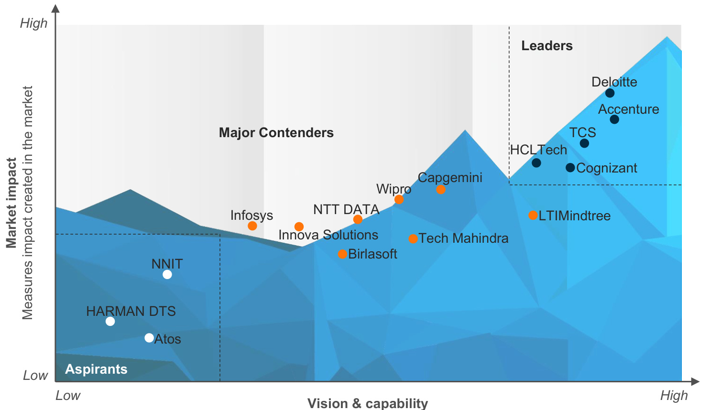
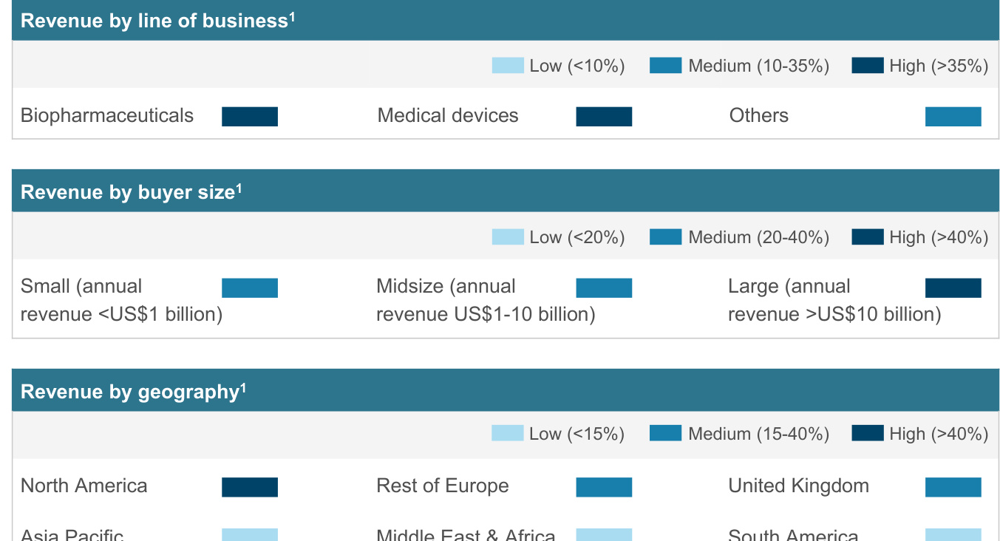
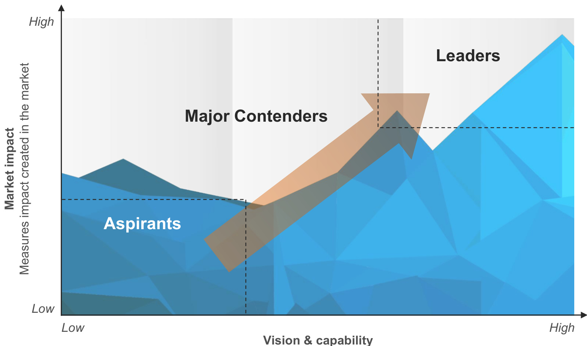
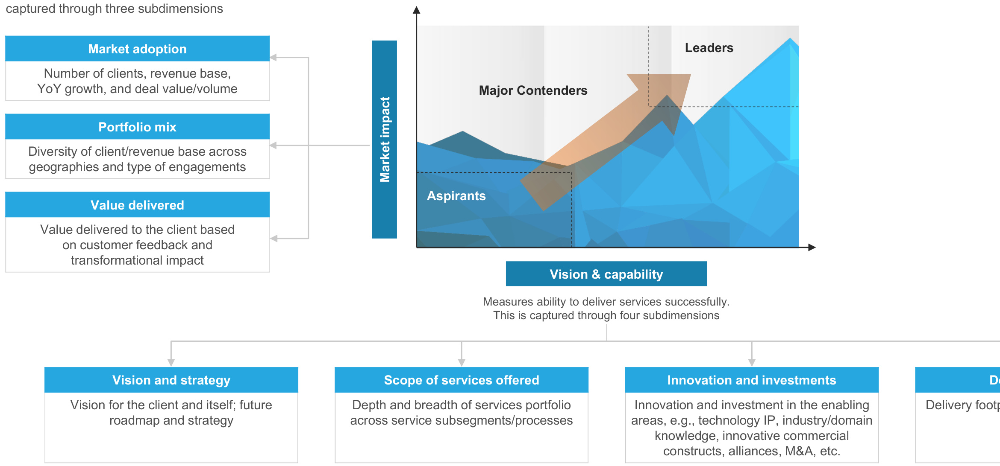

# Everest Group Life Sciences Smart Manufacturing Services PEAK Matrix® Assessment 2023  

Focus on Deloitte August 2023  

# Introduction  

Historically, the traditional manufacturing industry was primarily focused on designing standardized manufacturing procedures and managing labor and mechanical systems, but with the emergence of Industry 4.0, technology adoption has become widespread across industries, unlocking numerous benefits. However, the life sciences industry has been slow in adopting technology to modernize manufacturing setups. Nevertheless, the pandemic, regulatory frameworks, and the urge to achieve operational excellence are now driving the adoption of smart manufacturing services.  

Life sciences enterprises aim to unlock benefits such as cost optimization, increased productivity, visibility, and efficiency by investing in critical use cases, including digital twins, predictive maintenance, etc. They are also exploring high-growth opportunities such as sustainable manufacturing, batch-to-continuous manufacturing, and manufacturing of personalized medicines. As the industry experiences investments in smart manufacturing, service providers are taking on the role of end-to-end digital transformation partners by co-developing solutions to assist enterprises in their digital journeys.  

In the full report, we present an assessment of 16 life sciences service providers featured on the Life Sciences Smart Manufacturing Services PEAK Matrix® Assessment 2023. The assessment is based on Everest Group’s annual RFI process for the calendar year 2023, interactions with leading life sciences service providers, client reference checks, and a ongoing analysis of the life sciences smart manufacturing services market.  

ll report includes the profiles of the following 16 leading life sciences service providers featured on the Life Sciences Smart Manufacturing Services PEAK Matrix:  

⚫ Leaders: Accenture, Cognizant, Deloitte, HCLTech, and TCS   
⚫ Major Contenders: Capgemini, Tech Mahindra, LTIMindtree, Wipro, NTT DATA, Innova Solutions, Birlasoft, and Infosys   
⚫ Aspirants: Atos, HARMAN DTS, and NNIT  

Scope of this report  

# Life Sciences Smart Manufacturing Services PEAK Matrix® characteristics  

# Leaders  

Accenture, Cognizant, Deloitte, HCLTech, and TCS  

⚫ Leaders have positioned themselves as digital transformation partners for enterprises with end-to-end capabilities, and offer a balanced breadth of offerings across the life sciences manufacturing value chain   
⚫ They demonstrate flexibility and innovation while pitching engagement models and commercial constructs, and possess a distinct talent pool specializing in the life sciences smart manufacturing space   
⚫ There is a presence of a robust partnership ecosystem and investments aligned with the demand of the enterprises in the areas of digital twins, IoT-enabled analytics, cybersecurity, et as well as high-growth opportunity areas such as specialty drugs manufacturing, sustainable manufacturing, and batch-to-continuous manufacturing   
⚫ They showcase a clear future roadmap to better supplement their internal capabilities and fill in the gaps in their existing portfolio of services through the development of IP, CoEs, and strategic initiatives  

# Major Contenders  

Capgemini, Tech Mahindra, LTIMindtree, Wipro, NTT DATA, Innova Solutions, Birlasoft, and Infosys  

⚫ Major Contenders comprise a varied mix of midsize and large firms. They possess a relatively less balanced portfolio compared to Leaders and are inclined toward specialization in certain specific areas of the value chain. Additionally, they offer limited solutions around high-growth opportunity areas such as specialty drugs manufacturing, sustainable manufacturing, and batch-to-continuous manufacturing   
⚫ Major Contenders have shortcomings in certain areas of the manufacturing value chain; the prevalent approach to address smart manufacturing use cases is by harnessing cross-industry intellectual property, talent, and partnerships   
⚫ They have substantiated their position within the mid-tier segment of clients by pursuing active client management and ramping up/down resources commensurate to the ask of buye  

Aspirants  

Atos, HARMAN DTS, and NNIT  

⚫ When it comes to their services portfolio, Aspirants have restricted their focus to specific areas in the life sciences manufacturing value chain, with limited digital service capabilities   
⚫ They have a limited partnership ecosystem and place more focus on leveraging horizontal capabilities to cater to the needs of life sciences enterprises rather than developing domain-specific services through CoEs and strategic alliances   
⚫ They have a dedicated focus on capturing the market share in the small and midsize buyer segment  

# Everest Group PEAK Matrix®  

# Life Sciences Smart Manufacturing Services PEAK Matrix® Assessment 2023 | Deloitte is positioned as a Leader  

Everest Group Life Sciences Smart Manufacturing Services PEAK Matrix® Assessment 20231,2,3  

  
Measures ability to deliver services successfully  

# Deloitte profile (page 1 of 6) Overview  

# Company mission  

Deloitte's Life Sciences Smart Manufacturing practice partners with life sciences enterprises in reimagining and reconfiguring their value chains to ensure the reliable and efficient supply of affordable and accessible therapies and medical products to the end customers, resulting in enhanced well-being of patients. It supports clients in their digital transformation journey and pushes life sciences manufacturing into the next generation of digital evolution. This is achieved through substantial investments in expanding global smart manufacturing capabilities, fostering robust partnerships, developing proprietary IP-based assets, leveraging smart factory technology, and nurturing talent.  

# Overview of the client base  

Among its diverse customer base, Deloitte's life science smart manufacturing practice engages with the top 10 largest global pharmaceutical enterprises, top 10 largest BioTech enterprises, 9 out of the top 10 medical device enterprises, and 18 out of the 21 largest life sciences enterprises.  

  

# Deloitte profile (page 2 of 6) Case studies  

# Case study  

Transformation of Quality Management System (QMS) for a global pharmaceutical manufacturer  

# Case study 2  

Developing a global security standard for the manufacturing sites of a global pharmaceutical enterprise  

# Business challenge  

The client faced challenges with high costs of quality and the regulatory risks in managing compliance. It had basic and disconnected platforms for quality processes, and lacked integration and traceability. To address this, the client identified a QMS platform and set ambitious timelines to deploy multiple Quality System Elements (QSEs) across more than five sites.  

# Solution  

Deloitte assisted the client in their QMS transformation journey by assessing the current state of QSEs and conducting a process design exercise. Additionally, it built solutions tailored to client requirements, including customization with next-generation functionalities, performed detailed validation and system testing, and supported the change management process through a training program strategy.  

# Impact  

⚫ Assisted the clients in realizing benefits worth US\$30 million by eliminating non-value-added work, thereby reducing overhead expenses ⚫ Deployed more than 10 QSEs in 14 months across five manufacturing sites ⚫ Ensured QMS process adoption for more than 700 employees globally  

# Business challenge  

The client recognized the necessity of developing and implementing a global security standard across all manufacturing and R&D sites to enhance the security maturity of Internet of Things (IoT), Industrial Control Systems (ICS), and Operational Technology (OT).  

# Solution  

Deloitte implemented a tailored OT cybersecurity framework, conducted detailed site security assessments, and deployed monitoring solutions to enhance OT asset security monitoring, visibility, and situational awareness. It also deployed threat intelligence and analytics for detecting OT cybersecurity threats and established standards, communication plans, playbooks, and workflows for incident response and recovery.  

# Impact  

⚫ Deployed 14 OT security controls ⚫ Remediated 42 manufacturing and R&D sites ⚫ Identified and monitored more than 30,000 OT digital assets  

# Deloitte profile (page 3 of 6) Offerings  

Proprietary smart manufacturing solutions – such as IP, platforms, accelerators, and tools (representative list)   

<html><body><table><tr><td>Solution</td><td>Details</td></tr><tr><td>Supplychaincontroltowerplatform</td><td>It is an end-to-endplatformsolutionthatassistsclientsbyprovidingprescriptive insights,monitoring transaction-level data,and offeringanalyticalcapabilities acrossthe manufacturingandsupplychainprocesses.</td></tr><tr><td>CentralSight</td><td>It hasthecapabilitiestoeffectivelyvisualizeamulti-tierdeepsupplierecosystem,helpingenterprisesidentifyand addresstheassociatedriskswithintheecosystemina timelymanner.</td></tr><tr><td>Smartfactorycapabilitycompass</td><td>It is an application that assists clients in assessing the current manufacturingmaturity and readiness of theirsites for smart factoryinvestments and initiatives.</td></tr><tr><td>CognitiveSparkformanufacturing</td><td>It isa cloud-based,Al-powered solution designed to assist biopharma and MedTech manufacturerswith insights that help optimize manufacturing processes and improveproduct quality.</td></tr><tr><td>Turnkey loT</td><td>It isasuiteofpre-configuredsolutionacceleratorstailoredtohigh-potentialmanufacturingusecases.</td></tr><tr><td>ManagedExtendedDetectionandResponse (MXDR)</td><td>It isaSaaS-based,modularcybersecuritysolutiondesigned toprotectenterprisesfrominternal and external cyber threats.</td></tr><tr><td>Greenlight</td><td>This is a decarbonization solution designed to achieve net-zero emissions.It includes a package of dashboard modules that can ingest Green House Gas(GHG) emissions and</td></tr><tr><td>IDEA</td><td>It is anloT-based application that helps clients manage real-time energy consumption from different sources,combining the loT approachwith traditional EnergyManagement Systems(EMS).</td></tr><tr><td>Digital loT</td><td>It is a preconfigured Siemens MindSphere application that offers a cloud-based, open loT operating system connecting products, plants, systems, and machines. This application unifiesdatafromDigitalProductLifecycleManagement(DPLM),DataAcquisitionand ManagementSystem(DAMS),Digital ManufacturingExecutionSystem(DMES),andloT systemsontoanintegrateddashboard,therebyenabling actionableinsights.</td></tr></table></body></html>  

# Deloitte profile (page 4 of 6) Offerings  

Proprietary smart manufacturing solutions – such as IP, platforms, accelerators, and tools (representative list)   

<html><body><table><tr><td>Solution</td><td>Details</td></tr><tr><td>SupplyHorizon</td><td>Itenablesenterprisestoproactivelyidentifyandmitigatesupplychainissues.It leveragesinternalandexternaldata,riskprofiling,mitigationplanning,persona-based visualizations,andAltoenableavisibilityofmulti-tiersupplynetworksandsenseanyupcomingrisksinordertomitigatedisruptions.</td></tr><tr><td>Smartmanufacturingplatform</td><td>Thisisaplatformsolutionthatenablesthecomprehensiveviewofmanufacturingoperationsacrosstheorganizationwithconnecteddatafromdisparatesystemstocreatedynam datavisualizationsthatprovideusefulinsightsandrecommendedactions.Itassistsinpredictiveanalytics,qualityanalytics,planningandmanagement,shopfloortrackingand serialization,etc.</td></tr><tr><td>Supplier360</td><td>Itisanend-to-endmanagementsolutionthatimprovessupplierrelationshipsbyconsolidatingdatafromvariousdisparatesourcestogenerateactionableinsightsonsupplier performance,connectingstakeholders,andmore.</td></tr></table></body></html>  

# Deloitte profile (page 5 of 6) Recent developments  

<html><body><table><tr><td colspan="5">Keyevents- resentative list)</td></tr><tr><td>Event name</td><td>Type of event</td><td>Year</td><td>Details</td><td>Forged a multi-party partnership with AwS,HighByte, and Element to help manufacturers connect, structure, and manage industrial data at scale through an open</td></tr><tr><td>Industrial datafabric</td><td>Alliance</td><td></td><td>2023</td><td>industrialdataframework;supportsDeloitte'ssmartmanufacturingplatformandservices,offeringdataanalytics,predictiveinsights,andfastertime-to-valuefor manufacturers</td></tr><tr><td>Nubik</td><td>Acquisition</td><td></td><td>2022</td><td>Acquiredtostrengthen itspresence and leadershipintheSalesforcepractice andfirm upitsrelationships and offeringsformid-market clients;it willassistclientswith advancedsolutionsinmanufacturinganddistribution</td></tr><tr><td>OCT Emissions Solutions</td><td>Acquisition</td><td></td><td>2022</td><td>Acquiredtoassist clientswithanend-to-endoffering across the climatechange and decarbonizationlifecycle.It providessolutionsforhydrogen,carbonsequestration andoffsets,andcarbondioxidecleanup</td></tr><tr><td>AE Cloud Consultant</td><td>Acquisition</td><td></td><td>2022</td><td>Acquired to deploy front-end and back-end solutions for order management, production management, supply chain management,warehouse and fulfillment, procurement,etc.,forenterprises</td></tr><tr><td>Smartfactories spread across global locations</td><td>Investment</td><td></td><td>2022</td><td>The smart factories that are spread across the globe serve as an ecosystem of smart manufacturing capabilities built on advanced technologies such as loT,</td></tr><tr><td>Check Point</td><td>Alliance</td><td></td><td>2021</td><td>Alliance with Check Point, a leading provider of cybersecurity solutions,to assist Deloite in strengthening Industry 4.0 technologies by securing the enterprise manufacturingandsupplychaininfrastructure</td></tr><tr><td>Syncronic</td><td>Acquisition</td><td></td><td>2021</td><td>Acquired to enhance its supply chain practice in the Nordics region</td></tr><tr><td>aeCyberSolutions</td><td>Acquisition</td><td></td><td>2021</td><td>Acquired tostrengthen itscybersecurityofferings</td></tr><tr><td>Digital Immunity</td><td>Alliance</td><td></td><td>2020</td><td>Alliance with Digital Immunity toleverage Deloitte's multiple OT lab environments,such as the Smart Factory inWichita,to accelerate deployment testing by utilizing configurationanddeploymentguidelinesfromthelabenvironment</td></tr><tr><td>Nozomi</td><td>Alliance</td><td></td><td>2020</td><td>Alliance with Nozomi Networks to deliverIT,OT,and loT security servicesinthe EMEA region.This collaboration aims to assistenterprises in enhancing their threat detectioncapabilitiesandimplementingeffectivecyberrisksolutions</td></tr><tr><td>Beelogix</td><td>Acquisition</td><td></td><td>2019</td><td>AcquiredtoexpanditscapabilitiesandleadershipinSAPdigitalsupplychainsolution</td></tr></table></body></html>  

# Deloitte profile (page 6 of 6) Everest Group assessment – Leader  

<html><body><table><tr><td colspan="5">Market impact</td><td colspan="4">Vision &capability</td></tr><tr><td>Market adoption</td><td>Portfolio mix</td><td>Value delivered</td><td>Overall</td><td>Vision and strategy</td><td>Scope of services offered</td><td>Innovation and investments</td><td>Delivery footprint</td><td>Overall</td></tr><tr><td></td><td></td><td></td><td></td><td></td><td></td><td></td><td></td><td></td></tr></table></body></html>  

# Strengths  

# Limitations  

⚫ Deloitte has made substantial investments in developing manufacturing solutions throughout the life sciences value chain, focusing on futuristic domain use cases such as cell and gene therapy manufacturing and sustainable manufacturing. It is further reinforced by its dedicated investments in building the Wichita smart factory, which strengthens its capabilities in IoT, cybersecurity, digital twins, robotics, etc.   
⚫ While clients highlight the premium pricing points, they acknowledge the innovative commercial constructs offered by Deloitte and perceive the dollar value per service provided to be better compared to peers   
⚫ Clients view Deloitte as a reliable strategic partner as it addresses both the existing and emerging business problems, even by engaging third-party providers if necessary   
⚫ Clients appreciate the high quality of the talent deployed and the strong technical domain knowledge they possess  

⚫ Although clients appreciate the technical and domain expertise of the talent deployed, they expect better attrition management to ensure seamless project delivery ⚫ Deloitte's tendency to consistently agree with clients without conducting thorough evaluations can reveal a lack of critical assessment and hinder their ability to make decisions that align with the enterprise's expertise and best interests ⚫ While clients appreciate Deloitte’s strategic inputs, they look for better transparency and alignment with the enterprise stakeholders  

Appendix  

# Everest Group PEAK Matrix® is a proprietary framework for assessment of market impact and vision & capability  

Everest Group PEAK Matrix  

  
Measures ability to deliver services successfully  

# Services PEAK Matrix® evaluation dimensions  

  

# Does the PEAK Matrix® assessment incorporate any subjective criteria?  

Everest Group’s PEAK Matrix assessment takes an unbiased and fact-based approach that leverages provider / technology vendor RFIs and Everest Group’s proprietary databases containing providers’ deals and operational capability information. In addition, we validate/fine-tune these results based on our market experience, buyer interaction, and provider/vendor briefings.  

# Is being a Major Contender or Aspirant on the PEAK Matrix, an unfavorable outcome?  

No. The PEAK Matrix highlights and positions only the best-in-class providers / technology vendors in a particular space. There are a number of providers from the broader universe that are assessed and do Matrix at all. Therefore, being represented on the PEAK Matrix is itself a favorable recognition.  

What other aspects of the PEAK Matrix assessment are relevant to buyers and providers other than the PEAK Matrix positioning?  

A PEAK Matrix positioning is only one aspect of Everest Group’s overall assessment. In addition to assigning a Leader, Major Contender, or Aspirant label, Everest Group highlights the distinctive capabilities and unique attributes of all the providers assessed on the PEAK Matrix. The detailed metric-level assessment and associated commentary are helpful for buyers in selecting providers/vendors for their specific requirements. They also help providers/vendors demonstrate their strengths in specific areas.  

# What are the incentives for buyers and providers to participate/provide input to PEAK Matrix research?  

⚫ For providers The RFI process is a vital way to help us keep current on capabilities; it forms the basis for our database – without participation, it is difficult to effectively match capabilities to buyer inquiries   
– In addition, it helps the provider/vendor organization gain brand visibility through being in included in our research reports  

# What is the process for a provider / technology vendor to leverage its PEAK Matrix positioning?  

⚫ Providers/vendors can use their PEAK Matrix positioning or Star Performer rating in multiple ways including: – Issue a press release declaring positioning; see our citation policies – Purchase a customized PEAK Matrix profile for circulation with clients, prospects, etc. The package includes the profile as well as quotes from Everest Group analysts, which can be used in PR – Use PEAK Matrix badges for branding across communications (e-mail signatures, marketing brochures, credential packs, client presentations, etc.)   
⚫ The provider must obtain the requisite licensing and distribution rights for the above activities through an agreement with Everest Group; please contact your CD or contact us  

# Does the PEAK Matrix evaluation criteria change over a period of time?  

PEAK Matrix assessments are designed to serve enterprises’ current and future needs. Given the dynamic nature of the global services market and rampant disruption, the assessment criteria are realigned as and when needed to reflect the current market reality and to serve enterprises’ future expectations.  

# Everest Group R  

With you on the journey  

Everest Group is a leading research firm helping business leaders make confident decisions. We guide clients through today’s market challenges and strengthen their strategies by applying contextualized problem-solving to their unique situations. This drives maximized operational and financial performance and transformative experiences. Our deep expertise and tenacious research focused on technology, business processes, and engineering through the lenses of talent, sustainability, and sourcing delivers precise and action-oriented guidance. Find further details and in-depth content at www.everestgrp.com.  

# Stay connected  

# NOTICE AND DISCLAIMERS  

IMPORTANT INFORMATION. PLEASE REVIEW THIS NOTICE CAREFULLY AND IN ITS ENTIRETY.   
THROUGH YOUR ACCESS, YOU AGREE TO EVEREST GROUP’S TERMS OF USE.  

Dallas (Headquarters) info@everestgrp.com +1-214-451-3000  

Website everestgrp.com  

Everest Group’s Terms of Use, available at www.everestgrp.com/terms-of-use/, is hereby incorporated by reference as if fully reproduced herein. Parts of these terms are pasted below for convenience; please refer to the link above for the full version of the Terms of Use.  

Bangalore india@everestgrp.com +91-80-61463500  

Social Media @EverestGroup T @Everest Group @Everest Group ? @Everest Group  

Everest Group is not registered as an investment adviser or research analyst with the U.S. Securities and Exchange Commission, the Financial Industry Regulatory Authority (FINRA), or any state or foreign securities regulatory authority. For the avoidance of doubt, Everest Group is not providing any advice concerning securities as defined by the law or any regulatory entity or an analysis of equity securities as defined by the law or any regulatory entity.  

Delhi india@everestgrp.com +91-124-496-1000  

Blog everestgrp.com/blog  

London   
unitedkingdom@everestgrp.com   
+44-207-129-1318  

All Everest Group Products and/or Services are for informational purposes only and are provided “as is” without any warranty of any kind. You understand and expressly agree that you assume the entire risk as to your use and any reliance upon any Product or Service. Everest Group is not a legal, tax, financial, or investment advisor, and nothing provided by Everest Group is legal, tax, financial, or investment advice. Nothing Everest Group provides is an offer to sell or a solicitation of an offer to purchase any securities or instruments from any entity. Nothing from Everest Group may be used or relied upon in evaluating the merits of any investment. Do not base any investment decisions, in whole or part, on anything provided by Everest Group.  

Toronto canada@everestgrp.com +1-214-451-3000  

This document is for informational purposes only, and it is being provided “as is” and “as available” without any warranty of any kind, including any warranties of completeness, adequacy, or fitness for a particular purpose. Everest Group is not a legal or investment adviser; the contents of this document should not be construed as legal, tax, or investment advice. This document should not be used as a substitute for consultation with professional advisors, and Everest Group disclaims liability for any actions or decisions not to act that are taken as a result of any material in this publication.  

Products and/or Services represent research opinions or viewpoints, not representations or statements of fact. Accessing, using, or receiving a grant of access to an Everest Group Product and/or Service does not constitute any recommendation by Everest Group that recipient (1) take any action or refrain from taking any action or (2) enter into a particular transaction. Nothing from Everest Group will be relied upon or interpreted as a promise or representation as to past, present, or future performance of a business or a market. The information contained in any Everest Group Product and/or Service is as of the date prepared, and Everest Group has no duty or obligation to update or revise the information or documentation. Everest Group may have obtained information that appears in its Products and/or Services from the parties mentioned therein, public sources, or third-party sources, including information related to financials, estimates, and/or forecasts. Everest Group has not audited such information and assumes no responsibility for independently verifying such information as Everest Group has relied on such information being complete and accurate in all respects. Note, companies mentioned in Products and/or Services may be customers of Everest Group or have interacted with Everest Group in some other way, including, without limitation, participating in Everest Group research activities.  

  